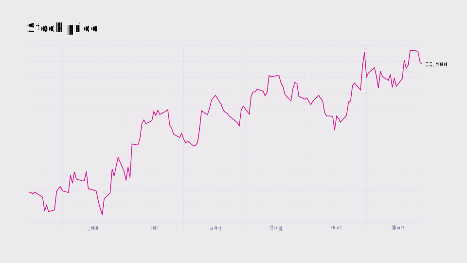

This is an image which is stored as part of the pages asset in the `content/` subdirectory:

This post overrides the `name` page variable, by specifying another name as part of the metadata file `default.yaml` in the post's directory. See how the URL and post title differ.
